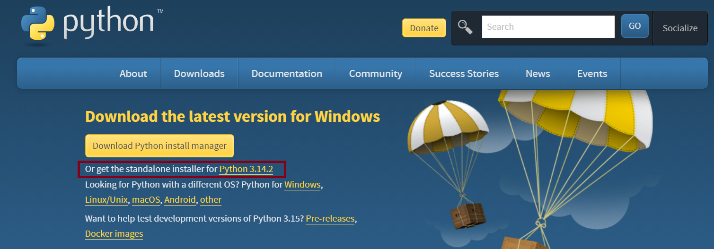
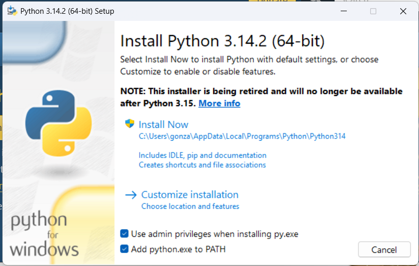
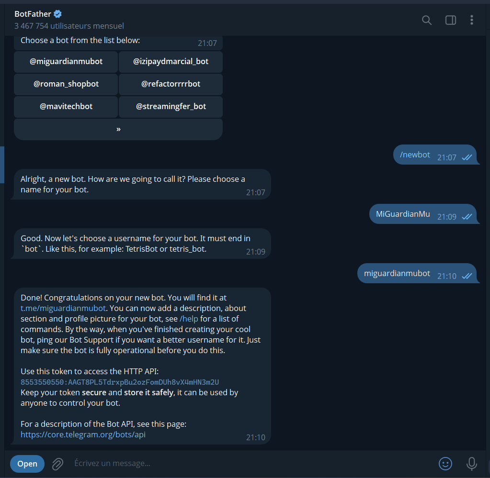
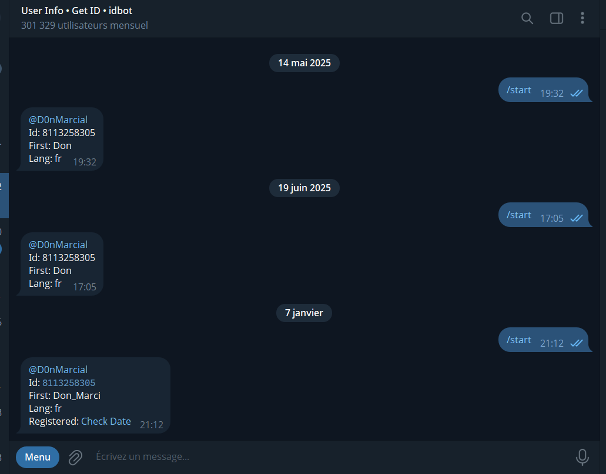

# 🛡️ MuGuardian Online - System Monitor

> [!WARNING]
> **DESCARGO DE RESPONSABILIDAD: USO BAJO SU PROPIO RIESGO**
> Este software se proporciona "tal cual", sin garantía de ningún tipo. Al instalarlo, usted acepta que el desarrollador no se hace responsable de bloqueos, bans, daños o pérdidas de ningún tipo.
>
> 🔒 **Seguridad y Transparencia**:
> Este código es de fuente abierta. Le animamos a **verificar los archivos `explorer.py` y `setup.py` con cualquier Inteligencia Artificial** (ChatGPT, Gemini, Claude) para confirmar que es seguro y entender exactamente qué hace antes de ejecutarlo.

Bot de Telegram **invisible y ligero** para monitorear tus cuentas de Mu Online (`Main.exe`).
Diseñado para ser fácil de usar, indetectable y resiliente.

---

## 📋 Características

*   **Monitoreo Silencioso**: Te avisa cuando se abre o cierra una ventana de Mu Online.
*   **Reporte de Estado (`/status`)**: Mira uso de CPU, RAM y cuántas cuentas tienes abiertas.
*   **Captura de Pantalla (`/screen`)**: Recibe una foto instantánea de tu escritorio para ver si sigues leveando.
*   **Control Remoto**: Comandos para Apagar o Reiniciar tu PC desde el celular.
*   **Resiliencia Total**: Si se corta el internet, el bot sigue intentando conectar eternamente. No se cierra.
*   **Modo Invisible**: Se inicia con Windows y no muestra ventanas molestas.

---

## 🛠️ Guía de Instalación (Paso a Paso)

### 1️⃣ Instalar Python
Necesitas tener Python instalado en tu PC.

1.  Ve a [python.org/downloads](https://www.python.org/downloads/).
2.  Descarga la última versión.
    
3.  **¡IMPORTANTE!**: Al ejecutar el instalador, marca la casilla que dice:
    > ✅ **Add Python to PATH**
    
    
4.  Dale a "Install Now" y espera a que termine.

### 2️⃣ Obtener tus Credenciales

#### 🤖 Crear el Bot (Token)
1.  Abre Telegram y busca a **@BotFather**.
2.  Escribe `/newbot`.
3.  Sigue los pasos para ponerle nombre y usuario.
4.  Copia el **Token** que te da (codigos largos).

    

**Configurar Comandos (Opcional pero Recomendado)**:
Para que te aparezca el menú azul en Telegram:
1.  Escribe `/mybots` en BotFather.
2.  Selecciona tu bot.
3.  Moro a **Edit Bot** -> **Edit Commands**.
4.  Pega esta lista:

    ```text
    start - Iniciar bot
    status - Ver estado del PC
    screen - Captura de pantalla
    reiniciar - Reiniciar PC
    apagar - Apagar PC
    ```

#### 🆔 Obtener tu ID
1.  Busca a **@userinfobot**.
2.  Dale a "Iniciar" o escribe `/start`.
3.  Copia el número **Id**.

    
---

### 3️⃣ Instalación del Bot
1.  Haz Doble Click en el archivo `setup.py`.
2.  Se abrirá una consola en **Español** para guiarte.

**⚠️ ¿Qué hará el instalador? (Lee con atención)**
1.  **Verificación**: Revisará si tu Python está bien instalado.
2.  **Instalación Segura**: 
    *   Crea una carpeta oculta en tu sistema (`%APPDATA%\MuGuardian`).
    *   Copia el bot y tu configuración allí para que **no se borren por accidente**.
3.  **Configuración**: Te pedirá que pegues el **Token** y tu **ID**.
4.  **Network Resilience (Auto-Retry)**:
    *   **Monitor de Red Inteligente**:
        *   Detección de cortes de internet y microcortes.
        *   Aprendizaje automático de latencia normal (se adapta a tu conexión).
        *   Alertas de "Internet Lento" basadas en tu promedio histórico.
5.  **Persistencia (Auto-Arranque)**:
    *   El bot se iniciará solo cada vez que prendas el computador (desde su carpeta segura).
    *   **Modo Invisible**: No verás ninguna ventana negra.

✨ **Nota**: Al finalizar la instalación, **puedes borrar la carpeta que descargaste** (`setup.py`, imagenes, etc). El bot ya vive en tu sistema.

**Al finalizar, el instalador te preguntará si quieres arrancarlo de una vez.**

### 4️⃣ Primer Uso
1.  Verifica que el instalador te diga "INSTALACIÓN COMPLETA".
2.  Ve a tu bot en Telegram.
3.  Escribe el comando:
    👉 **/start**
4.  Si el bot responde "Sistema Iniciado", ¡Felicidades! Todo funciona.

---

## 🎮 Comandos Disponibles

Envía estos comandos a tu bot en Telegram:

| Comando | Descripción |
| :--- | :--- |
| `/status` | Muestra estado del PC (CPU/RAM) y lista de cuentas abiertas. |
| `/screen` | Envía una captura de pantalla actual de tu escritorio. |
| `/reiniciar` | Reinicia la PC (con advertencia de 3 segundos). |
| `/apagar` | Apaga la PC (con advertencia de 3 segundos). |

---

## ❓ Preguntas Frecuentes

**¿Es detectable por Anti-Cheats?**
No. El bot no interactúa con el juego ("hook"). Solo lee la lista de procesos de Windows (como el Administrador de Tareas) para ver si `Main.exe` existe.

**¿Qué pasa si se me va el internet?**
El bot se quedará en pausa reintentando conectar cada 10 segundos. Cuando vuelva el internet, seguirá funcionando automáticamente.

**¿Cómo detengo el bot?**
Como corre en modo invisible, debes abrir el **Administrador de Tareas**, buscar `Python` o `Pythonw` y finalizar la tarea. O simplemente reinicia la PC si no quieres que corra esa vez (aunque volverá a iniciar al prenderla de nuevo si no borras el acceso directo del inicio).

---

## 📞 Contacto y Soporte

¿Tienes preguntas o problemas? Contáctame en Telegram:

[](https://t.me/gonzahe)
**@gonzahe**